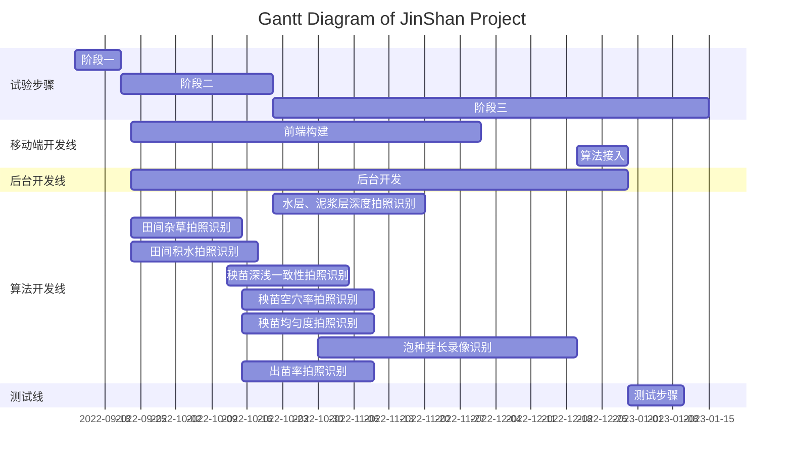
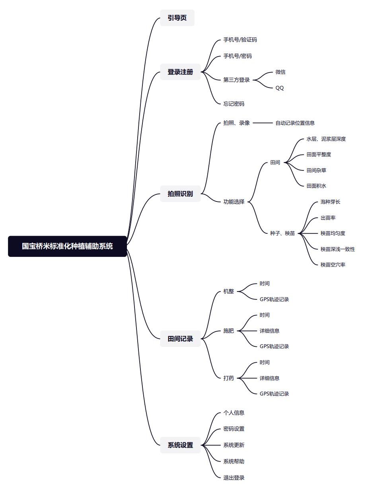
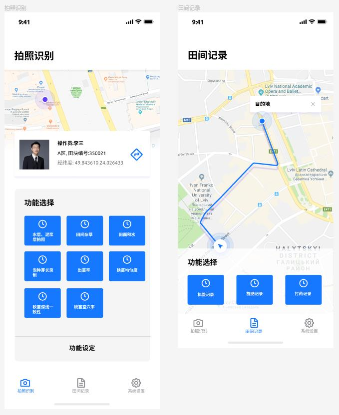

# 国宝桥米标准化种植辅助系统项目计划

## 1 任务说明

此次项目我们需要完成的开发任务如下

### 1.1 软件开发任务

| 软件开发任务               | 开发技术设定   | 备注                  |
| :------------------------- | -------------- | --------------------- |
| 国宝桥米标准化种植手机app  | flutter        | 依照田园宝app进行改制 |
| 国宝桥米桌面端后台管理系统 | electron + Vue | 无                    |

### 1.2 后台及数据库开发任务

| 后台及数据库开发任务         | 开发技术设定 | 备注 |
| ---------------------------- | :----------- | ---- |
| 国宝桥米标准化种植后台开发   | java spring  | 无   |
| 国宝桥米标准化种植数据库开发 | SQL          | 无   |

### 1.3 算法开发任务

| 算法开发任务             | 开发框架设定                                                 | 备注                                                      |
| ------------------------ | ------------------------------------------------------------ | --------------------------------------------------------- |
| 水层、泥浆层深度拍照识别 | 分水岭算法&目标物体检测算法                                  | 标尺界定，图像矫正                                        |
| 田间杂草拍照识别         | based on [Coca: Contrastive Captioners are Image-Text Foundation Models](https://paperswithcode.com/paper/coca-contrastive-captioners-are-image-text) | [Source Code](https://github.com/lucidrains/CoCa-pytorch) |
| 田间积水拍照识别         | based on [Coca: Contrastive Captioners are Image-Text Foundation Models](https://paperswithcode.com/paper/coca-contrastive-captioners-are-image-text) | [Source Code](https://github.com/lucidrains/CoCa-pytorch) |
| 秧苗深浅一致性拍照识别   | based on [DINO: DETR with Improved DeNoising Anchor Boxes for End-to-End Object Detection](https://paperswithcode.com/paper/dino-detr-with-improved-denoising-anchor-1#code) | [Source Code](https://github.com/IDEA-Research/DINO)      |
| 秧苗空穴率拍照识别       | 目标检测&点阵分布（自研）                                    | 无                                                        |
| 秧苗均匀度拍照识别       | 目标检测&均匀度分布测定算法（自研）                          | 无                                                        |
| 泡种芽长录像识别         | based on [YOLOV: Making Still Image Object Detectors Great at Video Object Detection](https://paperswithcode.com/paper/yolov-making-still-image-object-detectors#code) | [Source Code](https://github.com/yuhengsss/yolov)         |
| 出苗率拍照识别           | 目标检测&点阵分布（自研）                                    | 无                                                        |

## 2 任务时间线

此次任务的开发时间线如下。

### 2.1 实验步骤time line

| 开始时间       | 结束时间       | 事件安排                         | 备注 |
| -------------- | -------------- | -------------------------------- | ---- |
| 2022年9月12日  | 2022年9月21日  | 灌排场实验田初步试验             | 无   |
| 2022年9月21日  | 2022年10月12日 | 蔡甸2亩试验田进行算法试验        | 无   |
| 2022年10月12日 | 2023年3月1日   | 京山水稻收割完成，进行规模化实验 | 无   |

### 2.2 移动端开发时间线

| 开始时间       | 结束时间       | 事件安排       | 备注                             |
| -------------- | -------------- | -------------- | -------------------------------- |
| 2022年9月23日  | 2022年12月1日  | 移动端app开发  | flutter双端构建，3种轨迹记录功能 |
| 2022年12月20日 | 2022年12月30日 | 移动端算法接入 | 8个算法部署接入                  |

### 2.3 后台开发时间线

| 开始时间      | 结束时间       | 事件安排        | 备注 |
| ------------- | -------------- | --------------- | ---- |
| 2022年9月23日 | 2022年12月30日 | 后台&数据库开发 | 无   |

### 2.4 算法开发时间线

| 开始时间       | 结束时间       | 事件安排                 | 备注 |
| -------------- | -------------- | ------------------------ | ---- |
| 2022年10月21日 | 2022年11月20日 | 水层、泥浆层深度拍照识别 | 无   |
| 2022年9月23日  | 2022年10月15日 | 田间杂草拍照识别         | 无   |
| 2022年9月23日  | 2022年10月18日 | 田间积水拍照识别         | 无   |
| 2022年10月12日 | 2022年11月5日  | 秧苗深浅一致性拍照识别   | 无   |
| 2022年10月15日 | 2022年11月10日 | 秧苗空穴率拍照识别       | 无   |
| 2022年10月15日 | 2022年11月10日 | 秧苗均匀度拍照识别       | 无   |
| 2022年10月30日 | 2022年12月20日 | 泡种芽长录像识别         | 无   |
| 2022年10月15日 | 2022年11月10日 | 出苗率拍照识别           | 无   |

### 2.5 开发周期Gantt图

## 3 具体任务分析

此次任务的具体细分任务（部分）如下。

### 3.1 国宝桥米标准化种植app前端原型。

如上所示，为国宝桥米标准化种植复制系统的思维导图（by 王雅婷），包含全部的系统功能，包括8个算法和3个记录流程。

国宝桥米标准化种植app的代码主体，引用自田园宝早期版本。其新ui分布构建参考[figma国宝桥米项目](https://www.figma.com/file/iUS13HiEKu0tvYf3DX1QLp/Untitled?node-id=3%3A88)。

1. 拍照识别模块引入8中算法调用模块，通过地图选定田块位置，选中田块后进行模块选择。
2. 田间记录，选定记录功能(可以多选)——>弹出弹框填写记录详细信息——>开始记录。

其余部分功能不做分析。

### 3.2 后台任务详情

后台和数据库需要满足的重点条件：

1.  田块划分，对国宝桥米耕种的田块进行无人机试飞划分田块。
2. 8种算法部署

### 3.3 算法框架详情

#### 3.3.1 水层、泥浆层深度拍照识别

分水岭算法&目标物体检测算法

设计思路：

1. 物体检测检索出拍照标尺的位置。
2. 图像矫正，给最大对比度，给一个30°左右的倾角循环，检索出竖直方向的白点积分最大值，那就是标准正角度。
3. 分水岭算法区分作标值和右读取值。

#### 3.3.2 田间杂草拍照识别&田间积水拍照识别

based on [Coca: Contrastive Captioners are Image-Text Foundation Models](https://paperswithcode.com/paper/coca-contrastive-captioners-are-image-text)

#### 3.3.3 秧苗深浅一致性拍照识别

based on [DINO: DETR with Improved DeNoising Anchor Boxes for End-to-End Object Detection](https://paperswithcode.com/paper/dino-detr-with-improved-denoising-anchor-1#code)

#### 3.3.4 秧苗空穴率拍照识别&出苗率拍照识别

目标检测&点阵分布（自研）

设计思路：

1. 检测图片中的所有秧苗点。
2. 根据**图论**给定出一个全连接骨架。
3. 调整图框架使外骨骼呈长方形，内部虚构空缺点使得锚点能均匀分布。
4. 对虚构锚点计数

#### 3.3.5 秧苗均匀度拍照识别

目标检测&均匀度分布测定算法（自研）

设计思路：

1. 检测图片中的所有秧苗点。
2. 给定一个均匀度检测算法。

#### 3.3.6 泡种芽长录像识别

based on [YOLOV: Making Still Image Object Detectors Great at Video Object Detection](https://paperswithcode.com/paper/yolov-making-still-image-object-detectors#code)